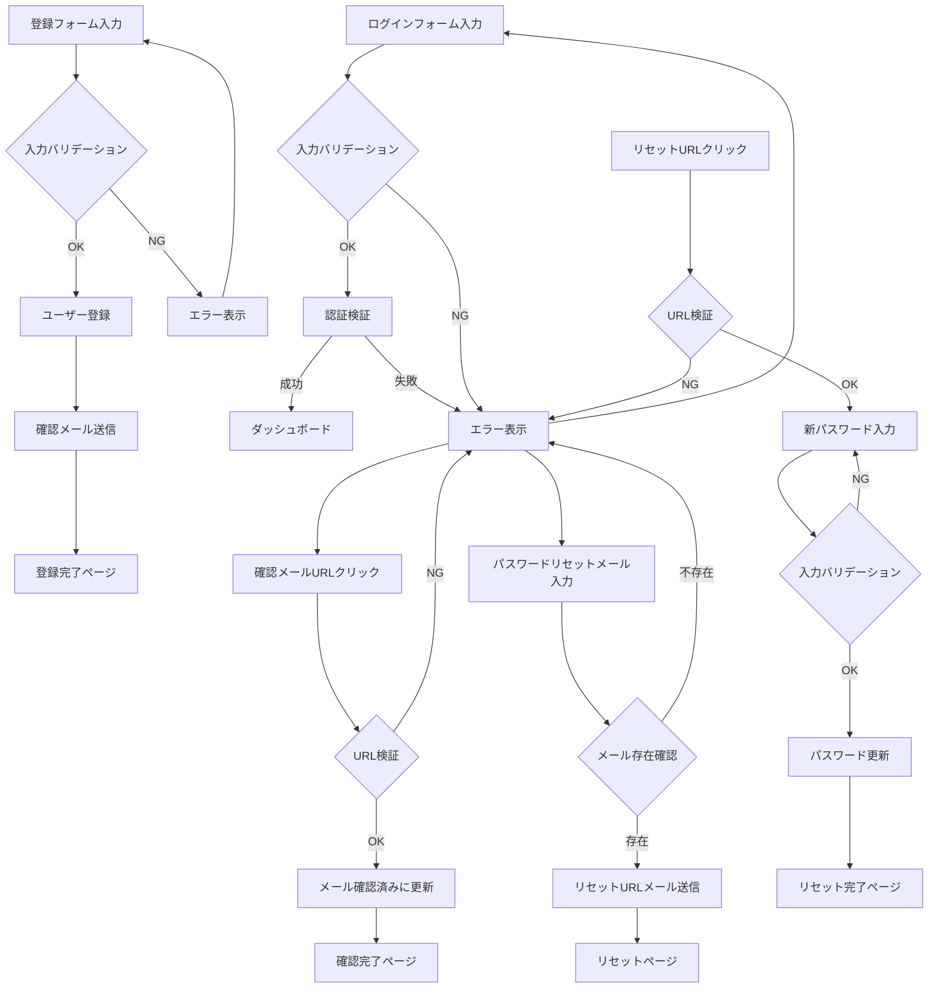

# Laravel Breeze Auth

## フローチャート (mermaid)

```mermaid
graph TD
    A[登録フォーム入力] --> B{入力バリデーション};
    B -- OK --> C[ユーザー登録];
    C --> D[確認メール送信];
    D --> E[登録完了ページ];
    B -- NG --> F[エラー表示];
    F --> A;

    G[ログインフォーム入力] --> H{入力バリデーション};
    H -- OK --> I[認証検証];
    I -- 成功 --> J[ダッシュボード];
    I -- 失敗 --> K[エラー表示];
    K --> G;
    H -- NG --> K;

    L[確認メールURLクリック] --> M{URL検証};
    M -- OK --> N[メール確認済みに更新];
    N --> O[確認完了ページ];
    M -- NG --> K;
    K --> L;

    P[パスワードリセットメール入力] --> Q{メール存在確認};
    Q -- 存在 --> R[リセットURLメール送信];
    R --> S[リセットページ];
    Q -- 不存在 --> K;
    K --> P;
    T[リセットURLクリック] --> U{URL検証};
    U -- OK --> V[新パスワード入力];
    V --> W{入力バリデーション};
    W -- OK --> X[パスワード更新];
    X --> Y[リセット完了ページ];
    W -- NG --> V;
    U -- NG --> K;
```
